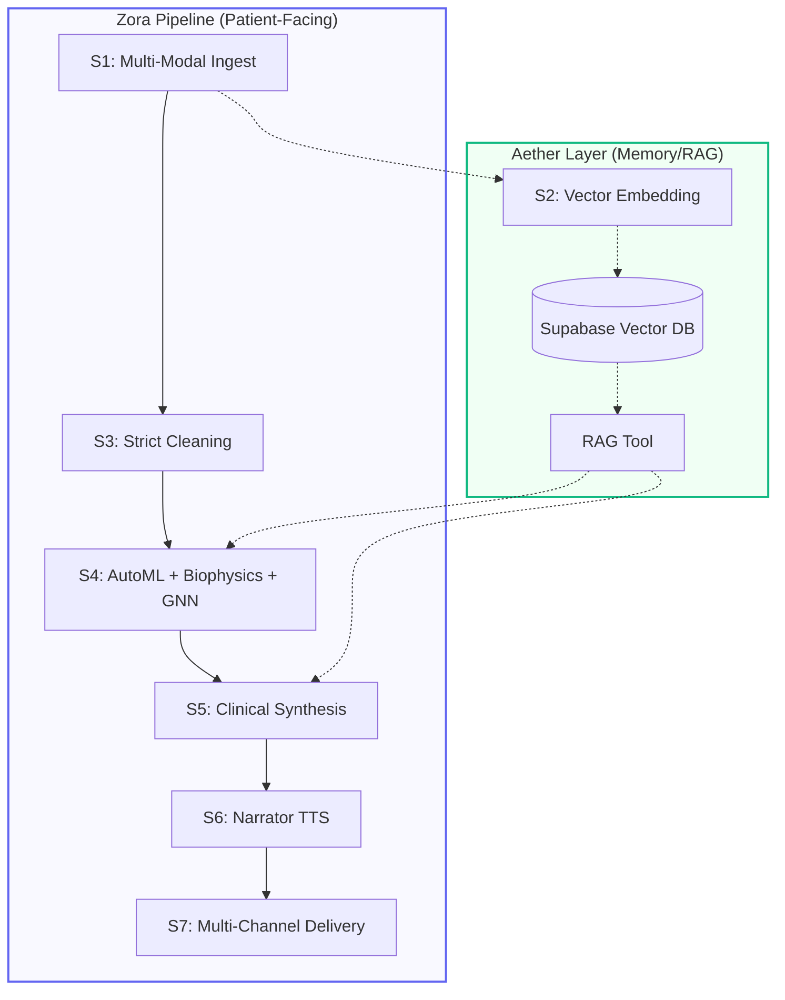

# Zora ML: Autonomous Multi-Modal Healthcare Analytics 🧬🤖

Zora is a state-of-the-art autonomous healthcare analytics platform designed to solve the "last mile" problem in clinical data science. It transforms raw, multi-modal datasets into actionable clinical insights using a fleet of specialized AI agents.

## 🌟 Key Features

- **Multi-Modal Data Ingestion**: Correlate CSV clinical records with protein sequences (`.fasta`) and clinical documentation (`.pdf`) in a single unified pipeline.
- **Biophysics-Aware Analysis**: Integrated **AlphaFold** structure prediction and **SASA** (Solvent Accessible Surface Area) stability scoring.
- **Network Intelligence**: Proprietary **GNN Agent** that identifies "Hidden Hub" proteins using STRING DB interaction networks.
- **Aether Memory Layer**: A high-performance RAG (Retrieval-Augmented Generation) system powered by Supabase pgvector and Gemini embeddings.
- **Strict Data Engineering**: Automated IQR outlier removal and a 2-stage LLM Critic loop ensuring 7/10+ clinical data quality.
- **Executive Delivery**: Multi-dual voice synthesis (Narrator agent) for clinical briefings and automated Telegram/Twilio notifications.

## 🏗️ System Architecture

Zora operates on a 7-stage autonomous pipeline, partitioned into two namespaces: **Zora** (Patient-facing operations) and **Aether** (Knowledge & Memory).



## 🛠️ Tech Stack

- **Backend**: Python 3.11, FastAPI, CrewAI
- **Database**: Supabase (PostgreSQL + pgvector)
- **AI Models**: Gemini 2.0 Flash, LLaMA 3.3 (Groq), BioPython, PyTorch Geometric
- **Frontend**: Vanilla JS / Next.js 14 Integration

## 🚦 Getting Started

### 1. Prerequisites
- Python 3.11+
- Supabase account with `pgvector` enabled.
- API Keys: Google Gemini, Groq, Twilio/Telegram (optional).

### 2. Installation
```bash
# Clone the repository
git clone https://github.com/Gaman-123/Spot-Coders_backend.git
cd Spot-Coders_backend

# Setup virtual environment
python -m venv venv
source venv/bin/activate  # or .\venv\Scripts\activate on Windows

# Install dependencies
pip install -r requirements.txt
```

### 3. Database Setup
Run the master migration script found in `zora/sql/2026-04-09_master_update.sql` in your Supabase SQL Editor. This will safely add all necessary columns and tables.

### 4. Configuration
Create a `.env` file in the `zora/` directory:
```env
GOOGLE_API_KEY=your_key
GROQ_API_KEY=your_key
SUPABASE_URL=your_url
SUPABASE_SERVICE_KEY=your_key
```

### 5. Running the App
```bash
cd zora
uvicorn main:app --reload
```

## 📄 License
This project is licensed under the MIT License. Developed by **Spot Coders**.
